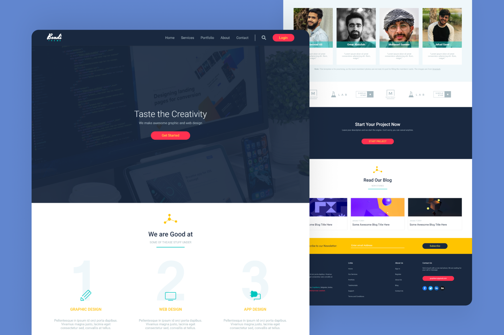

<h1 align='center'>Bondi Theme Agency Website</h1>

A creative, colorful, and responsive landing page for small agency, built by converting a PSD web template made by [Graphberry](https://www.graphberry.com/item/bondi-psd-landing-page) into a usable and responsive website using HTML and CSS with a clean code. It comes in a modern and minimalist style with flat colors looks great and professional in any web browser.

## Preview

## Live Demo
[Click here](https://mohjarabahh.github.io/bondi-website) to check out the live demo!

## Technologies
* HTML
* CSS
* [Google Fonts](https://fonts.google.com)
* [Font Awesome](https://fontawesome.com)
* [GitHub Pages](https://pages.github.com)

## Credits
* PSD Template is from [Graphberry](https://www.graphberry.com)
* Images are from [Unsplash](https://unsplash.com)

## License
This project is licensed under the [MIT License](./LICENSE).
